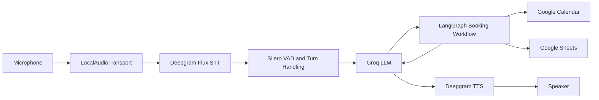

# Agentix Labs AI Voice Receptionist

A real-time AI voice receptionist built with Pipecat and LangGraph. The agent listens through a laptop microphone, understands callers, handles normal business conversations, checks Google Calendar availability, books appointments, saves leads to Google Sheets, and speaks responses through the laptop speakers.

## Features

- Real-time microphone and speaker conversation
- Deepgram Flux speech-to-text
- Silero voice activity detection
- Groq-powered conversational reasoning
- Deepgram text-to-speech
- Natural interruption and barge-in support
- Stateful LangGraph appointment workflow
- Google Calendar availability and event creation
- Final availability re-check before booking
- Google Sheets lead capture
- Progressive slot discovery by morning, afternoon, or evening
- Stable LangGraph `thread_id` throughout a caller session
- Duplicate booking and duplicate lead-write protection
- Natural spoken responses for every workflow state

## Architecture



LangGraph owns the complete booking workflow. Calendar and Sheets operations are not duplicated in the Pipecat layer.

## Technology Stack

| Component | Technology |
|---|---|
| Voice orchestration | Pipecat AI 1.10.0 |
| Workflow orchestration | LangGraph |
| Speech-to-text | Deepgram Flux |
| Voice activity detection | Silero VAD |
| Language model | Groq |
| Text-to-speech | Deepgram |
| Local audio | PyAudio / Pipecat LocalAudioTransport |
| Scheduling | Google Calendar API |
| Lead storage | Google Sheets API |
| State persistence | LangGraph MemorySaver |

## Project Structure

```text
pipecat-project/
├── main.py                         # Real-time Pipecat voice pipeline
├── agent/
│   ├── booking_session.py          # Pipecat-to-LangGraph session bridge
│   └── graph.py                    # Stateful booking workflow
├── prompts/
│   └── receptionist.md             # Receptionist behavior and voice instructions
├── services/
│   ├── google_auth.py              # Shared Google OAuth authentication
│   ├── google_calendar.py          # Availability and appointment operations
│   └── google_sheets.py            # Lead persistence
├── tests/
│   ├── test_booking_session.py     # Offline workflow and state tests
│   ├── test_booking_workflow.py    # Pipecat callback and completion tests
│   └── test_calendar.py            # Standalone live Calendar test script
├── credentials.json                # Local Google OAuth credentials; never commit
├── token.json                      # Generated OAuth token; never commit
└── .env                            # Local API keys; never commit
```

## Prerequisites

- Windows with a working microphone and speakers or headphones
- Python 3.11
- A Deepgram API key
- A Groq API key
- A Google Cloud project
- Google Calendar API enabled
- Google Sheets API enabled
- OAuth desktop application credentials from Google Cloud
- A Google Sheet for lead storage

Headphones are recommended during development to minimize acoustic feedback from laptop speakers into the microphone.

## Installation

Create and activate a virtual environment from the `Pipecat` directory:

```powershell
python -m venv .pipevenv
& ".\.pipevenv\Scripts\Activate.ps1"
```

Install the required packages:

```powershell
pip install "pipecat-ai[deepgram,groq,local,silero]==1.10.0" `
    langgraph `
    python-dotenv `
    loguru `
    google-api-python-client `
    google-auth `
    google-auth-oauthlib
```

## Environment Configuration

Create `.env` inside `pipecat-project`:

```dotenv
GROQ_API_KEY=your_groq_api_key
DEEPGRAM_API_KEY=your_deepgram_api_key
GOOGLE_SHEET_ID=your_google_spreadsheet_id
```

`GOOGLE_CLIENT_ID` and `GOOGLE_CLIENT_SECRET` may also be retained in `.env` for other tooling, but this project authenticates through `credentials.json`.

Never commit `.env`, `credentials.json`, or `token.json`.

## Google OAuth Setup

1. Create or select a project in Google Cloud Console.
2. Enable the Google Calendar API and Google Sheets API.
3. Configure the OAuth consent screen.
4. Create OAuth credentials for a **Desktop app**.
5. Download the credentials file and save it as:

   ```text
   pipecat-project/credentials.json
   ```

6. Add your Google account as a test user if the OAuth application is still in testing mode.
7. Run the application from the project directory.
8. Complete the browser authorization prompt on the first run.

After authorization, the application creates `token.json`. Later runs reuse and refresh that token automatically.

The configured OAuth scopes permit Calendar and Sheets access:

```text
https://www.googleapis.com/auth/calendar
https://www.googleapis.com/auth/spreadsheets
```

## Google Sheets Setup

Create a spreadsheet and place its ID in `GOOGLE_SHEET_ID`. The default worksheet name is `Sheet1`.

Lead records are appended in this column order:

| Column | Value |
|---|---|
| A | Timestamp |
| B | Name |
| C | Email |
| D | Business |
| E | Industry |
| F | Problem |
| G | Volume |
| H | Current system |
| I | Interested service |
| J | Meeting date |
| K | Meeting time |

## Running the Voice Agent

Run the application from `pipecat-project` so relative Google credential paths resolve correctly:

```powershell
cd "D:\AI Internship\Pipecat\pipecat-project"
& "..\.pipevenv\Scripts\python.exe" main.py
```

Allow microphone access when Windows requests it. Speak normally after the application starts.

Example booking conversation:

```text
Caller: I would like to book a meeting tomorrow.
Assistant: What works better for you: morning, afternoon, or evening?
Caller: Afternoon.
Assistant: I have 2:00 PM, 2:30 PM, or 3:00 PM available. Which works best?
Caller: 2:30 PM.
Assistant: Great. Could I get your name and email to finalize the booking?
Caller: My name is Alex and my email is alex@example.com.
Assistant: You're all set. Your meeting is confirmed for tomorrow at 2:30 PM.
```

Only slots returned by Google Calendar are offered. The selected slot is checked again immediately before event creation.

## Booking Workflow

1. Detect a booking request.
2. Collect or resolve the requested date.
3. Fetch real Calendar availability.
4. Ask for a time preference when many slots are available.
5. Offer up to three real matching slots.
6. Collect the caller's name and email.
7. Re-check the selected slot.
8. Create the Calendar appointment.
9. Save the lead in Google Sheets.
10. Proactively speak the confirmed date and time.

LangGraph interruptions collect missing information across multiple voice turns. A stable session-specific `thread_id` allows the workflow to resume from the correct state.

## Tests

Run the offline booking and Pipecat integration tests:

```powershell
cd "D:\AI Internship\Pipecat\pipecat-project"
& "..\.pipevenv\Scripts\python.exe" -m unittest discover -s tests -p "test_booking*.py" -v
```

These tests mock external Calendar and Sheets writes. They cover state resumption, progressive slot filtering, final confirmation, stale-slot handling, duplicate protection, failure behavior, and Pipecat callback execution.

`tests/test_calendar.py` is a standalone live Google Calendar script. It requires valid credentials and network access and should not be included in the offline test command.

## Scheduling Configuration

Calendar behavior is configured in `services/google_calendar.py`:

```python
TIMEZONE = "Asia/Karachi"
BUSINESS_START_HOUR = 10
BUSINESS_END_HOUR = 18
APPOINTMENT_DURATION_MINUTES = 60
SLOT_STEP_MINUTES = 30
```

Update these constants to match the target business before deployment.

## Security

The included `.gitignore` excludes:

```gitignore
.env
credentials.json
token.json
```

If any of these files were previously committed or pushed, remove them from Git tracking and rotate the exposed credentials.

```powershell
git rm --cached .env credentials.json token.json
```

## Current Scope

- Designed for one local microphone caller session per process
- Uses in-memory LangGraph checkpoints
- Uses the primary Google Calendar
- Uses the `Sheet1` worksheet for lead storage
- Uses the `Asia/Karachi` timezone
- Does not currently include telephony, Asterisk, RAG, or persistent database checkpoints

## Troubleshooting

**Imports cannot be resolved in VS Code**

Select this interpreter:

```text
D:\AI Internship\Pipecat\.pipevenv\Scripts\python.exe
```

**Google authorization fails**

Confirm that `credentials.json` is present, both APIs are enabled, and your account is allowed by the OAuth consent screen.

**No microphone or speaker audio**

Check Windows privacy permissions and confirm that the expected input and output devices are configured as system defaults.

**The assistant hears its own voice**

Use headphones, reduce speaker volume, and verify that Windows audio enhancements or acoustic echo cancellation are enabled for the selected microphone device.

## License

No license has been specified for this project. Add a license before public distribution.
