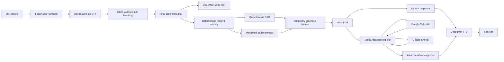

# Agentix Labs AI Voice Receptionist

A real-time local-microphone AI receptionist built with Pipecat 1.10 and LangGraph. It supports natural voice conversation, grounded Agentix company answers, persistent caller memory, Google Calendar booking, Google Sheets lead capture, and sanitized execution tracing.

## Current capabilities

- Laptop microphone and speaker conversation through `LocalAudioTransport`
- Deepgram Flux speech-to-text and Deepgram Aura text-to-speech
- Silero voice activity detection with interruption and barge-in
- Groq `openai/gpt-oss-120b` conversational reasoning
- Hybrid Agentix knowledge retrieval using dense and sparse vectors in Qdrant
- Closed-world grounding for company facts and service offerings
- Persistent caller-specific memory through a local VoiceMem sidecar
- Concurrent RAG and VoiceMem retrieval when both sources are relevant
- Stateful LangGraph booking with interrupt/resume support
- Real Calendar availability, final slot re-check, and event creation
- Confirmed Sheets append with duplicate-write protection
- Sanitized Pipecat metrics and interaction traces

## Runtime architecture

See [docs/architecture.md](docs/architecture.md) for the detailed system architecture.



Retrieved RAG and VoiceMem content is temporary context for one LLM request; it is not appended permanently to conversation history. LangGraph exclusively owns booking actions, so Calendar and Sheets writes are not duplicated by Pipecat.

## Knowledge authority

| Source | Authority |
|---|---|
| Current conversation | The caller's newest explicit facts and corrections |
| VoiceMem | Caller history, preferences, workflow, needs, and prior facts |
| Agentix RAG | Company facts, services, projects, technology, pricing, and policies |
| General LLM knowledge | Conversation that is not a company or caller-history claim |

Company questions are closed-world: a service is confirmed only when the knowledge base explicitly supports it. Caller-history questions use current conversation facts first and VoiceMem second. Missing caller details are not replaced with generic advice.

## Technology stack

| Component | Technology |
|---|---|
| Voice pipeline | Pipecat AI 1.10.0 |
| STT | Deepgram Flux `flux-general-en` |
| VAD | Silero VAD |
| LLM | Groq `openai/gpt-oss-120b` |
| TTS | Deepgram `aura-2-thalia-en` |
| Workflow | LangGraph with `MemorySaver` |
| Dense retrieval | FastEmbed `BAAI/bge-small-en-v1.5` |
| Sparse retrieval | FastEmbed/Qdrant BM25 with IDF |
| Fusion | Qdrant reciprocal rank fusion |
| Parsing/chunking | Docling `HybridChunker` |
| Vector database | Qdrant at `http://localhost:6333` |
| Caller memory | VoiceMem localhost sidecar |
| Business systems | Google Calendar and Google Sheets APIs |

## Repository layout

```text
pipecat-voice-agent/
|-- main.py                         # Pipecat pipeline and booking tool bridge
|-- trace_recorder.py               # Sanitized representative JSON trace
|-- requirements.txt                # Voice-agent and RAG dependencies
|-- .env.example                    # Safe environment template
|-- agent/
|   |-- booking_session.py          # Per-call LangGraph session bridge
|   `-- graph.py                    # Booking graph and Google actions
|-- knowledge/
|   |-- agentix_rag_knowledge_base.md
|   `-- agentix_pricing_benchmark_notes.md
|-- memory/
|   |-- caller_identity.py          # Stable local caller identity
|   |-- voicemem_adapter.py         # Fail-open sidecar client
|   |-- integration.py              # READ routing, WRITE filtering, context
|   `-- orchestration.py            # Concurrent RAG/VoiceMem prefetch
|-- prompts/
|   `-- receptionist.md             # Receptionist and tool instructions
|-- rag/
|   |-- config.py                   # Models, collection, retrieval limits
|   |-- models.py                   # Lazy dense and sparse models
|   |-- index.py                    # Explicit Docling/Qdrant indexing
|   |-- retrieve.py                 # Hybrid search and RRF fusion
|   |-- integration.py              # Routing and grounded context
|   |-- cli.py                      # Standalone retrieval CLI
|   `-- evaluate.py                 # Retrieval evaluation set
|-- services/
|   |-- google_auth.py              # Shared Google OAuth
|   |-- google_calendar.py          # Availability and events
|   `-- google_sheets.py            # Verified lead append
`-- tests/                           # Mocked regression suites
```

VoiceMem remains in a separate sibling repository. The commands below assume
this portable layout:

```text
workspace/
|-- pipecat-voice-agent/
|   `-- .venv/
`-- VoiceMem/
    |-- .venv/
    `-- service/app.py
```

## Prerequisites

- Windows and Python 3.11
- Working microphone and speakers; headphones are recommended
- Deepgram and Groq API keys
- Docker or another Qdrant 1.x installation
- Google Cloud project with Calendar and Sheets APIs enabled
- Google OAuth desktop credentials and a Sheet with a `Sheet1` tab
- Companion `VoiceMem/` repository for persistent memory

The agent remains usable if Qdrant or VoiceMem is unavailable. The affected retrieval path fails open while normal conversation and booking continue.

## Installation

From the `pipecat-voice-agent` repository root:

```powershell
python -m venv .venv
& ".\.venv\Scripts\Activate.ps1"
pip install -r requirements.txt
```

The project is pinned to Pipecat 1.10.0. Validate frame, turn, metrics, and service APIs before changing that version.

## Environment configuration

```powershell
Copy-Item .env.example .env
```

| Variable | Required | Purpose |
|---|---:|---|
| `GROQ_API_KEY` | Yes | Main LLM and VoiceMem extraction |
| `DEEPGRAM_API_KEY` | Yes | Flux STT and Aura TTS |
| `GOOGLE_SHEET_ID` | For lead saving | Destination spreadsheet |
| `TEST_CALLER_ID` | Recommended locally | Stable caller memory namespace |
| `VOICEMEM_SIDECAR_URL` | No | Defaults to `http://127.0.0.1:8765` |
| `GOOGLE_CLIENT_ID` | Optional | External credential tooling only |
| `GOOGLE_CLIENT_SECRET` | Optional | External credential tooling only |

Optional local additions:

```dotenv
TEST_CALLER_ID=demo_caller_001
VOICEMEM_SIDECAR_URL=http://127.0.0.1:8765
```

Never commit `.env`, OAuth files, private keys, local databases, Qdrant/VoiceMem storage, or traces.

## Google setup

1. Enable Google Calendar API and Google Sheets API.
2. Configure the OAuth consent screen and permitted test account.
3. Create OAuth credentials for a desktop application.
4. Save the download as `credentials.json` in this project root.
5. Start the agent and authorize it in the browser on first use.

The application creates `token.json` and reuses it. Both files are gitignored. Required scopes are:

```text
https://www.googleapis.com/auth/calendar
https://www.googleapis.com/auth/spreadsheets
```

Leads are appended to `Sheet1!A:K`:

| Column | Value |
|---|---|
| A | Timestamp |
| B | Name |
| C | Email |
| D | Business |
| E | Industry |
| F | Problem |
| G | Lead volume |
| H | Current system |
| I | Interested service |
| J | Meeting date |
| K | Meeting time |

Success is reported only when the Sheets API confirms one complete 11-column row.

## Start Qdrant and index the knowledge base

```powershell
docker run -d --name agentix-qdrant -p 6333:6333 `
  -v agentix-qdrant-data:/qdrant/storage qdrant/qdrant
```

For an existing container:

```powershell
docker start agentix-qdrant
```

Build or rebuild the index explicitly:

```powershell
& ".\.venv\Scripts\python.exe" -m rag.index
```

The indexer loads `knowledge/agentix_rag_knowledge_base.md` with Docling, chunks it with `HybridChunker`, creates dense BGE and sparse BM25 vectors, and stores both in `agentix_rag_knowledge`. Starting the voice agent does not re-index it.

Test retrieval:

```powershell
& ".\.venv\Scripts\python.exe" -m rag.cli
& ".\.venv\Scripts\python.exe" -m rag.cli "What is PongVerse?"
& ".\.venv\Scripts\python.exe" -m rag.evaluate
```

The retriever prefetches dense and sparse candidates, applies Qdrant RRF, and returns at most three chunks. The integration uses only the useful subset, preferring one strong chunk when sufficient.

## Start VoiceMem

VoiceMem runs separately to isolate its dependency stack. In another PowerShell window:

```powershell
Set-Location ..\VoiceMem
python -m venv .venv
& ".\.venv\Scripts\Activate.ps1"
pip install -e .
$env:TEST_CALLER_ID="demo_caller_001"
& ".\.venv\Scripts\python.exe" -m uvicorn service.app:app `
  --host 127.0.0.1 `
  --port 8765 `
  --env-file "..\pipecat-voice-agent\.env"
```

```powershell
Invoke-RestMethod http://127.0.0.1:8765/health
```

The sidecar hashes caller IDs with SHA-256 and stores each caller in a separate namespace. New callers initialize dynamically, so changing the caller ID does not require restarting the sidecar.

Live memory behavior:

- Caller-history/profile/workflow questions trigger deterministic READ routing.
- Useful self-disclosures are queued for non-blocking WRITE.
- Recall questions, greetings, contact details, and transactional booking fields are not written.
- Current conversation facts override older memories.
- A caller-specific write failure does not disable other callers.

## Run the voice agent

```powershell
$env:TEST_CALLER_ID="demo_caller_001"
& ".\.venv\Scripts\python.exe" .\main.py
```

Use a different stable ID to test caller isolation:

```powershell
$env:TEST_CALLER_ID="demo_caller_002"
& ".\.venv\Scripts\python.exe" .\main.py
```

Concise diagnostics show routing without exposing internals to the caller:

```text
Retrieval route: RAG
RAG: 1 chunks | 18.50 ms
Memory: skipped
```

## Booking flow

1. Groq calls `booking_workflow` for booking intent.
2. LangGraph resolves or requests the date.
3. Calendar returns real availability.
4. The workflow resolves a concrete time or offers real alternatives.
5. Name and email are collected after a valid slot is selected.
6. Ambiguous spoken email requires confirmation on a later caller turn.
7. The selected slot is checked again immediately before booking.
8. Calendar creates the event exactly once.
9. Sheets appends the lead exactly once.
10. The confirmed date/time is proactively spoken through normal TTS.

The workflow preserves date/time across missing-field collection and protects both writes from repeated tool calls.

## Sanitized execution trace

A completed booking writes:

```text
traces/representative_trace.json
```

The trace contains ordered timestamps, transcripts, retrieval decisions and latency, safe public RAG excerpts, exposed Pipecat metrics, tool results, Calendar/Sheets status and timing, errors/retries, and the final response.

Before disk write, the recorder redacts configured secrets, names, emails, phone numbers, spreadsheet IDs, Calendar event IDs, OAuth data, headers, and caller/thread IDs. Unavailable metrics are `null`; `traces/` is gitignored.

## Tests

Run the offline mocked suite without Groq, Deepgram, or Google API usage:

```powershell
& ".\.venv\Scripts\python.exe" -m unittest `
  tests.test_booking_conversation_e2e `
  tests.test_booking_session `
  tests.test_booking_workflow `
  tests.test_google_sheets `
  tests.test_memory_adapter `
  tests.test_rag_integration `
  tests.test_retrieval_orchestration `
  tests.test_trace_recorder -v
```

Run sidecar tests separately:

```powershell
Set-Location ..\VoiceMem
& ".\.venv\Scripts\python.exe" -m unittest service.test_app -v
```

`tests/test_calendar.py` is a standalone live Google Calendar script and is intentionally excluded from the offline command.

## Scheduling configuration

`services/google_calendar.py` currently uses:

```python
TIMEZONE = "Asia/Karachi"
BUSINESS_START_HOUR = 10
BUSINESS_END_HOUR = 18
APPOINTMENT_DURATION_MINUTES = 60
SLOT_STEP_MINUTES = 30
```

Update these constants for the target business before deployment.

## Security

`.gitignore` excludes environment files, OAuth credentials, private keys, local databases, Qdrant storage, traces, caches, environments, and editor files. If a secret was committed, remove it from tracking and rotate it:

```powershell
git rm --cached .env credentials.json token.json
```

Do not commit VoiceMem's caller-data directory from the companion repository.

## Current scope

- One local microphone/speaker caller session per voice-agent process
- Stable local caller identity through `TEST_CALLER_ID`
- In-memory LangGraph checkpoints for the active process
- Persistent VoiceMem namespaces in the sidecar
- Primary Google Calendar, `Sheet1`, and `Asia/Karachi`
- Local Qdrant for Agentix knowledge
- No telephony, Asterisk, reranker, external embedding API, or persistent LangGraph database yet

## Troubleshooting

**VS Code import warnings:** from the repository root, select
`.venv\Scripts\python.exe` as the Python interpreter.

**RAG unavailable:** confirm Qdrant is reachable on port `6333`, the collection exists, and `rag.cli` returns results.

**VoiceMem unavailable:** check `http://127.0.0.1:8765/health`, the sidecar `.env`, and the active `TEST_CALLER_ID`.

**Google authorization fails:** confirm both APIs, OAuth consent access, project-root `credentials.json`, and both required scopes.

**No audio:** check Windows microphone permissions and default input/output devices.

**Speaker echo enters STT:** use headphones and verify Windows acoustic echo cancellation. Keep Pipecat turn/interruption handling enabled.

## License

This project is licensed under the Apache License 2.0. See [LICENSE](LICENSE).

### Third-party software

- Pipecat is used under the BSD-2-Clause license.
- VoiceMem is a separate companion fork derived from
  [xzf-thu/VoiceMem](https://github.com/xzf-thu/VoiceMem) and remains licensed
  under Apache License 2.0.
- Other dependencies retain their respective licenses.

The project license does not replace, alter, or claim ownership of Pipecat,
VoiceMem, or any other third-party software.
