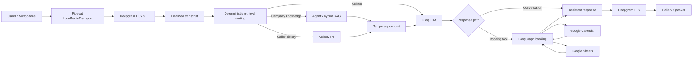
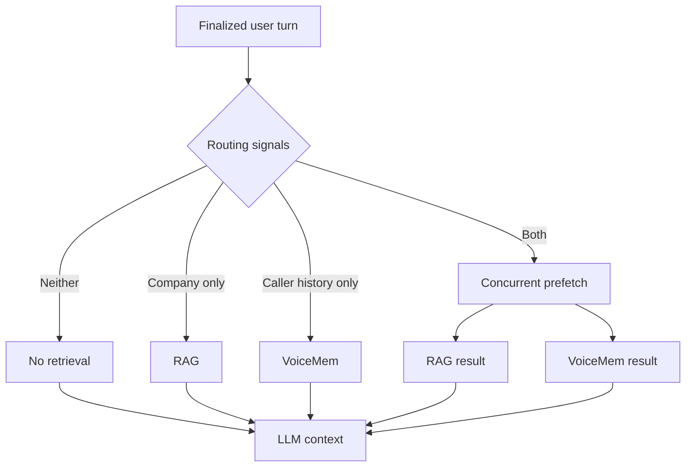

# System Architecture

## 1. Overview

This repository implements a real-time AI voice receptionist for a local microphone and speaker session. Pipecat coordinates streaming audio, speech services, conversational inference, turn handling, and tool execution. Deepgram provides speech-to-text and text-to-speech, Silero detects voice activity, and Groq generates conversational responses and selects the booking tool when required.

Two independent retrieval systems supply grounded context. Agentix RAG retrieves verified company knowledge from Qdrant. VoiceMem retrieves persistent, caller-specific memory through a separate local sidecar. LangGraph owns the appointment workflow and calls Google Calendar and Google Sheets. A small trace recorder captures sanitized execution events and the Pipecat metrics exposed by the configured providers.

## 2. High-Level Architecture

RAG and VoiceMem are independent branches. A turn may use either source, both sources, or neither source. Their results are composed only for the current inference request.

## 3. Real-Time Voice Pipeline

`LocalAudioTransport` captures laptop microphone audio and plays synthesized audio through the configured speaker. Deepgram Flux produces streaming transcripts, while Silero VAD and Pipecat's user aggregation determine when a caller turn is ready for processing.

The finalized transcript passes through memory-write filtering and then into the conversation context. Retrieval processors run before Groq so relevant company knowledge or caller history can be inserted as temporary developer context. Groq produces a normal response or calls the LangGraph booking bridge. Deepgram TTS converts the final text to audio.

Function-call muting protects active Calendar or Sheets operations from false acoustic interruptions and ends before synthesized speech begins. The caller can still interrupt assistant speech naturally.

## 4. Knowledge and Memory Architecture

### Agentix RAG

Agentix RAG is the authority for company information, including services, capabilities, projects, technologies, pricing, policies, and documented boundaries. Docling loads the Markdown knowledge base, and `HybridChunker` creates contextual chunks with heading metadata.

FastEmbed creates dense vectors with `BAAI/bge-small-en-v1.5` and sparse BM25 vectors in one Qdrant collection. Reciprocal rank fusion produces the final ranking. The integration uses up to three results and prefers one strong chunk when sufficient.

Retrieved company facts are temporary and governed by a closed-world rule. The agent confirms a company service only when the retrieved knowledge explicitly supports it or a clearly equivalent term. Related technology alone does not establish an undocumented service.

### VoiceMem

VoiceMem stores persistent information about an individual caller. Its Left Brain represents factual information, while its Right Brain can return preference, emotional, and relationship context. It runs as a separate localhost sidecar, uses local E5 embeddings, and keeps the heavier memory dependency stack outside the Pipecat environment.

Each stable caller ID maps to a SHA-256-derived storage namespace. Memory reads and writes survive restarts of the main voice-agent process. Eligible writes run asynchronously so extraction and persistence do not block the live transcript path.

The boundary is explicit:

- RAG answers: "What is true about Agentix?"
- VoiceMem answers: "What do we remember about this caller?"

## 5. Retrieval Orchestration

Deterministic routing produces four outcomes:

Routing uses lightweight intent, entity, and conversation signals; it does not make an additional LLM call. When both sources apply, their requests start concurrently. Per-turn keys prevent duplicate retrieval when Pipecat forwards the same context frame more than once. Company and caller-memory instructions remain separate when temporary context is composed.

## 6. Context Authority and Precedence

Authority is scoped by subject rather than treated as one interchangeable pool:

1. System and receptionist instructions define agent behavior.
2. Live tool results define current booking and external-system outcomes.
3. Agentix RAG defines company facts.
4. The caller's current explicit statement defines their present intent and corrections.
5. VoiceMem supplies historical caller facts when current context does not replace them.
6. General LLM knowledge is used only where company or caller-specific grounding is not required.

VoiceMem cannot define Agentix capabilities, and RAG is not a source of caller history. A current caller correction overrides stale memory. If neither the current conversation nor VoiceMem supports a caller-history answer, the agent states briefly that the detail is not known instead of generating a generic answer.

## 7. Booking Workflow

LangGraph owns booking state and all booking side effects. It collects or resolves the date, queries real Calendar availability, resolves a concrete slot, and offers nearby real alternatives when the requested time is unavailable. It does not collect name and email until availability has been answered and a valid slot is selected.

The workflow preserves the selected date and time while collecting missing identity fields. Ambiguous spoken email requires confirmation from a later caller turn. Immediately before booking, Calendar availability is checked again to prevent a stale or double-booked slot. The graph then creates the Calendar event, appends the lead to Sheets, and returns an exact final confirmation for the normal Pipecat TTS path.

Completion and in-flight guards ensure repeated tool calls do not create duplicate events or lead rows.

## 8. Failure Handling

| RAG | VoiceMem | Runtime behavior |
|---|---|---|
| OK | OK | Use the relevant results from either or both sources |
| OK | Failed | Continue with verified company context; omit caller memory |
| Failed | OK | Continue with caller memory; do not invent company facts |
| Failed | Failed | Continue normal conversation and booking without retrieved context |

Both retrieval paths fail open so an unavailable knowledge or memory service does not stop the voice pipeline. A caller-specific memory-write failure does not disable memory for other callers. The live path avoids aggressive retry loops because repeated network work would increase latency and could duplicate side effects.

## 9. Caller Identity and Isolation

Local testing uses `TEST_CALLER_ID` as a stable identity supplied by the environment. The same value must be reused when testing persistence for one caller. The sidecar hashes this identifier before selecting the caller-specific storage directory; callers are never matched by name alone.

New caller namespaces are created dynamically, so switching caller IDs does not require a sidecar restart. Separate identifiers remain isolated and cannot read each other's stored memories.

Phone-number-derived identity and HMAC namespace keys are future production work. They are not implemented by the current local transport.

## 10. Persistence and Write Strategy

Only finalized user transcript frames can become memory candidates. A deterministic filter accepts durable self-disclosures such as business facts, recurring problems, goals, and preferences. Writes are scheduled in the background and VoiceMem performs the actual fact extraction and persistence.

Recall questions, short filler, greetings, contact information, transactional booking details, internal tool context, and duplicate transcript frames are not blindly stored. A successful write must be confirmed by the sidecar. A result containing no new persistable memory is treated as a safe no-op. Stored memory remains available after restarting the main agent.

## 11. Observability

Console diagnostics report the selected retrieval route, RAG latency, VoiceMem latency, combined retrieval latency when both run, and memory-write success, no-op, or failure. They avoid printing credentials and raw memory internals.

The trace recorder captures ordered timestamps, sanitized caller and assistant events, retrieval decisions, safe excerpts from the public knowledge base, booking tool activity, external-operation timing and status, errors, retry counts, and Pipecat metrics that providers expose. Missing metrics are recorded as unavailable rather than estimated. Before disk write, configured secrets, OAuth data, external IDs, names, email addresses, phone numbers, and caller/thread identifiers are redacted.

## 12. Current Limitations

- Audio transport is a local microphone and speaker session.
- Caller identity is supplied through `TEST_CALLER_ID`, not telephony signaling.
- Qdrant runs locally and must be started separately.
- VoiceMem runs as a separate local sidecar.
- LangGraph checkpoints are in memory for the active process.
- Initial model loading can add RAG cold-start latency.
- Asterisk and telephone call handling are not implemented.

## 13. Future Production Direction

The following items are future work and are not implemented:

- Asterisk or another telephony transport
- Phone-number-derived HMAC caller identity
- Process supervision for the agent, Qdrant, and VoiceMem
- Production health monitoring and alerting
- Formal memory retention, deletion, and privacy policies
- Load, concurrency, and multi-call isolation testing

## 14. Architecture Summary

The design separates real-time audio, conversational inference, company knowledge, caller memory, and transactional booking. Retrieval is deterministic, temporary, and fail-open. RAG grounds Agentix facts, VoiceMem preserves caller context across sessions, and LangGraph owns stateful booking and external writes. These boundaries keep the live voice path responsive while preventing one knowledge source from silently assuming another source's authority.
